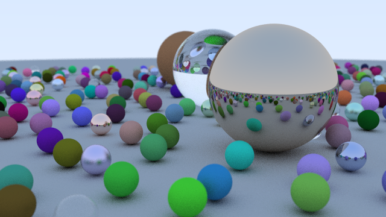

Simple path tracer implemented in Rust
======================================

This projects implements a _very_ simple path tracer, done with the main purpose of learning Rust.

I used the [Ray Tracing in a Weekend](http://in1weekend.blogspot.com/2016/01/ray-tracing-in-one-weekend.html) series as a reference. 
I strongly recommend to buy those books; they're a fantastic and very well written intro to ray tracing.

Some notes about this project:
* the implementation is very naive (feedback is welcome!)
* no optimization has been implemented
* live preview while rendering

When you run the program it will generate the following image:

